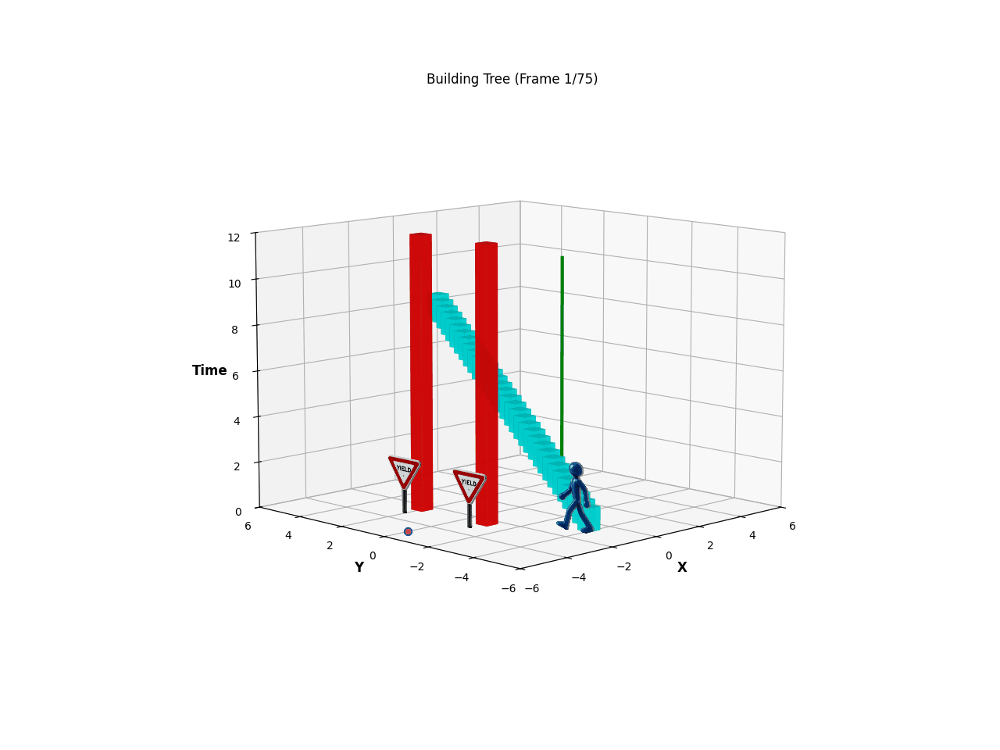
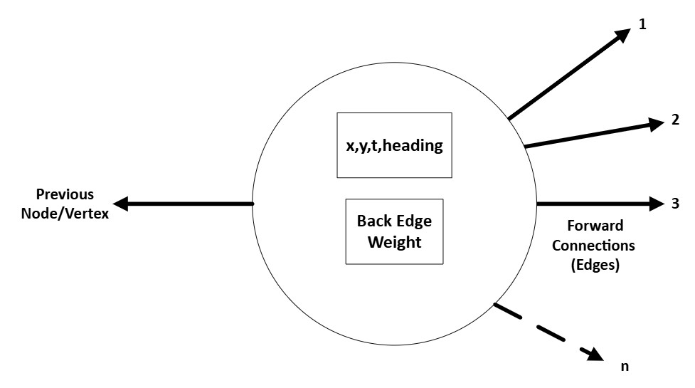
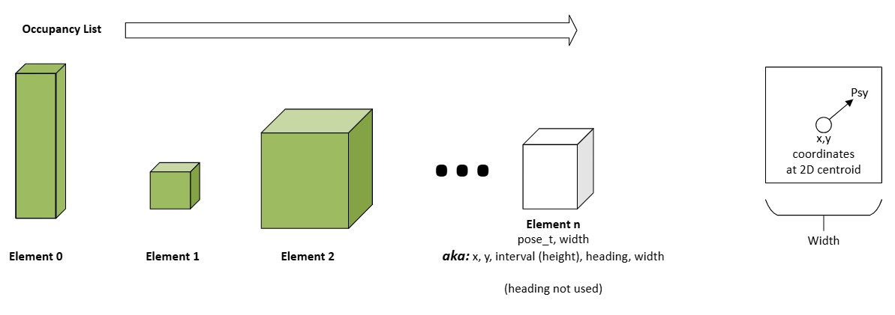

# rrt_graph_builder


A library which generates a constrained RRT graph in the form of a adjacency list and is intended for Robotic Path Planning. The user is permitted to use either absolute or dynamical geometric constraints when generating the RRT. Additionally, the user may select a maximum number of admissible trajectories the RRT can resolve to (intent being to perform old-school optimal control techniques, selecting the minima based on some performance measure)

Absolute Constraints:
1. Max angle permitted between two nodes (maximum change in pose/heading)
2. Max distance between two nodes
3. Min distance between two nodes
4. Maximum interval (time / 3D Height) permitted between two nodes

Dynamical Constraints:
1. Maximum Longitudinal Acceleration between two nodes
2. Maximum Longitudinal Jerk between two nodes
3. Maximum geometric curvature (Kappa) between two nodes, computed via Menger-Curvature

**The Graph Structure:**
The Graph is represented as an adjacency list, effectively a doubly connected linked list but with multiple forward connections. There is an additional constraint that a Node/vertex have exactly 1 back-connection. The user defined weight for this back connection is a class member for the node class. (If you wish to access the weight of a forward edge, to do so you'll need to traverse to the forward node). The node class itself will use a custom pose_t typedef that will be reused in several other places throughout this project.


**The RRT:**
The RRT is an inherited class from the more generalized graph-class in this project. The RRT generation is pretty straightforward and matches the academic definition. Because this is intended to be used for robotics, the RRT is built with several user-configured constraints. When growing an RRT Graph, constraints are applied to random node insertion. (SEE BELOW FOR DETAILS)


**A 3-Dimensional RRT**
This RRT Implementation optionally allows for the graph to be built in 3D space. The 3rd dimension; however, does not represent height/elevation. **In this implementation we do a "trick" and *represent time as a Physical Dimension***. As the graph grows vertically in the Z-axis, this will be used to represent displacement over time. The main goal in doing this is to limit/reduce the number of re-plans; assuming constant velocity for dynamic objects. (NEED TO ADD A GOOD PICTURE HERE)

**Occupancy Map/Grid**
*To increase optimality I did not go with some large voxelized 3D data structure to represent either the occupancy grid because this would effectively nullify the efficiencies of using an adjacency list for the RRT.* Here the occupancy grid (if desired) is a simple list of coordinates and the same coordinate custom type used in the RRT is also employed here. Appended to the coordinate is length/width/time-interval data. The idea here is you can generate a "cube" or a voxel of occupancy. and every element in the occupancy *"list"* can have its own unique dimensional constraint. This makes the occupancy list/data structure more sparse and thus more efficient.


# To-Do
**FUNCTIONAL**
1. The dynamical constraint of curvature (Kappa) should probably be updated to yaw-rate
2. The logic currently just makes sure that the RRT/admissible trajectory completes spatially (x,y). This logic should be enhanced to align to some pre determined pose/heading at the end state.
3. When building the graph there is presently no logic to incorporate an initial condition (aka initial velocity). This needs to be expanded upon.
4. If/When the velocity logic is added, the absolute and dynamical constraints on time/interval between 2 nodes will need to be updated so that it is rational against perceived velocity.

**NON_FUNCTIONAL**
1. Need more expansive testing, only really covered the basic graph functions, nothing in the way of the actually RRT methods has been rigorously tested

# Getting Started
These instructions will help you generate the necessary documentation for using this package, and list the required dependencies.

# Documentation
The documentation for this project is Doxygen based. To generate, execute the following commands:

````bash
cd <path>/rrt_graph_builder
doxygen Doxyfile
````

# Dependencies
The following dependencies are required, and can be installed accordingly.

## Debian/Ubuntu
````bash
sudo apt install doxygen

sudo apt install graphviz

sudo apt install cmake

sudo apt install libgtest-dev

sudo apt install build-essential g++ python3-dev

sudo apt install libboost-all-dev (For Visualization with matplotlib)
````
## macOS (using Homebrew)
````bash
brew install doxygen

brew install graphviz

brew install cmake

brew install googletest

brew install gcc python3
````
# Running the tests
To compile unit and pipeline tests, run the following script:
````bash
./scripts/run_tests.sh
````
The graphTest test verifies basic functionality 

graph.cpp 

## Built With

* [cmake](https://cmake.org/download/) - Build tool used for compiling this project
* [Google Test](https://github.com/google/googletest) - Unit testing framework


## Authors

* **Ryan Shedlock**

## License

This project is licensed under the MIT License - see the LICENSE file for details


