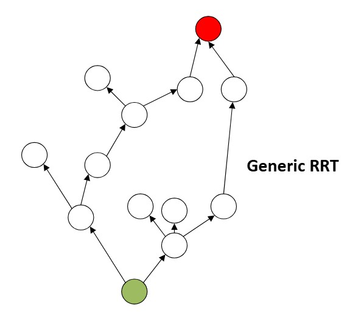

# rrt_graph_builder
WORK IN PROGRESS
Generates a constrained RRT graph in the form of a adjacency list. Intended for Robotic Path Planning.

**The Graph Structure:**
The Graph is represented as an adjacency list, effectively a doubly connected linked list but with multiple forward connections. There is an additional constraint that a Node/vertex have exactly 1 back-connection. The user defined weight for this back connection is a class member for the node class. (If you wish to access the weight of a forward edge, to do so you'll need to traverse to the forward node)

**The RRT:**
The RRT is an inherited class from the more generalized graph-class in this project. The RRT generation is pretty straightforward and matches the academic definition. Because this is intended to be used for robotics, the RRT is built with several user-configured constraints. When growing an RRT Graph, constraints are applied to random node insertion. At present we limit the maximum distance/angle to the next nearest node in the graph. This is done to ***ensure admissibility*** of the trajectory on the final outputted graph. We also apply a time interval limit (z axis) constraint to throttle the maximum allowed longitudinal acceleration. (SEE BELOW FOR DETAILS)

**A 3-Dimensional RRT**
This RRT Implementation optionally allows for the graph to be built in 3D space. The 3rd dimension; however, does not represent height/elevation. **In this implementation we do a "trick" and *represent time as a Physical Dimension***. As the graph grows vertically in the Z-axis, this will be used to represent displacement over time. The main goal in doing this is to limit/reduce the number of re-plans; assuming constant velocity for dynamic objects. (NEED TO ADD A GOOD PICTURE HERE)

**Occupancy Map/Grid**
*To increase optimality I did not go with some large 3D data structure to represent an occupancy grid because this would effectively nullify the efficiencies of using an adjacency list for the RRT.* Here the occupancy grid (if desired) is a simple list of coordinates and the same coordinate custom type used in the RRT is also employed here. Appended to the coordinate is length/width/time-interval data. The idea here is you can generate a "cube" or a voxel of occupancy. and every element in the occupancy *"list"* can have its own unique dimensional constraint. This makes the occupancy list/data structure more sparse and thus more efficient.

# Getting Started
These instructions will help you generate the necessary documentation for using this package, and list the required dependencies.

# Documentation
The documentation for this project is Doxygen based. To generate, execute the following commands:

cd <path>/rrt_graph_builder

doxygen Doxyfile
  
# Dependencies
The follwing dependencies are required, and can be installed accordingly.

sudo apt install doxygen

sudo apt install cmake

sudo apt install libgtest-dev

sudo apt install build-essential g++ python3-dev

sudo apt install libboost-all-dev (For Visualization with matplotlib)

# Running the tests
To compile unit and pipeline tests, run the following script:

./scripts/run_tests.sh

The graphTest test verifies basic functionality 

graph.cpp 

## Built With

* [cmake](https://cmake.org/download/) - Build tool used for compiling this project
* [Google Test](https://github.com/google/googletest) - Unit testing framework

## Authors

* **Ryan Shedlock**

## License

This project is licensed under the MIT License - see the LICENSE file for details

